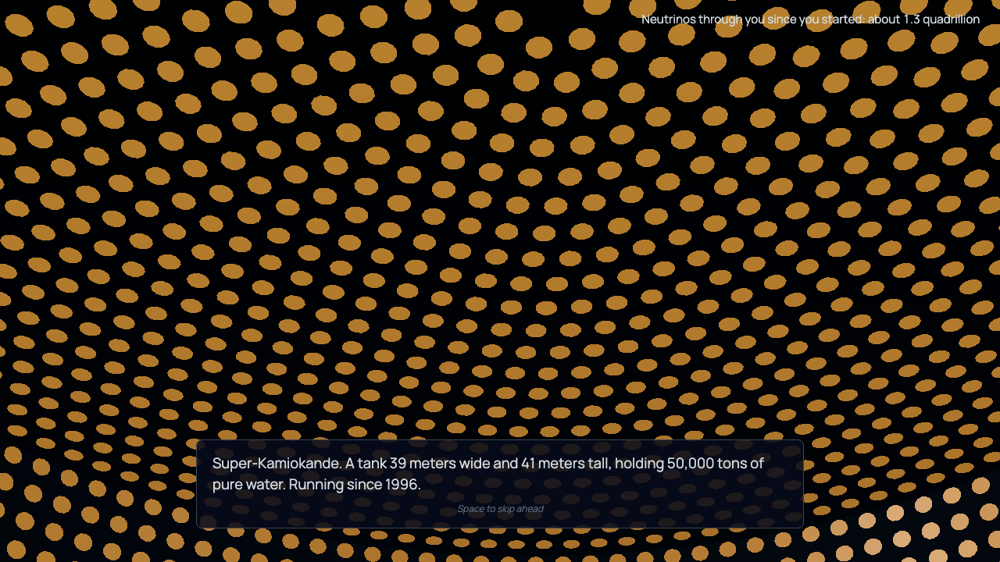

# Ghost Particle

An educational on-rails three.js game, about six minutes long. You are one neutrino, born in the Sun's core, and you ride it all the way to the moment a detector under a mountain in Japan finally sees you.

Play it at https://ghost-particle.exe.xyz/



## The game

Six levels, one scene and one mechanic each:

1. **Birth.** Wordless. Hold Space to squeeze two nuclei together and blink into existence.
2. **Meet the neutrino.** Weighed against an electron on a seesaw: what you are, how light you are, that you carry no charge.
3. **Escaping the Sun.** Steer into walls of plasma and pass through every one. Halfway out your flavor starts changing.
4. **The trip to Earth.** The Standard Model builds itself family by family; find yourself among the leptons.
5. **Super-Kamiokande.** Hit one electron, paint a ring of light on 11,129 sensors, then sort five more rings as the physicist.
6. **The Sun in neutrinos.** Thousands of detected neutrinos land on a black sky until the Sun emerges, and a counter shows how many passed through you while you played.

Controls: Space, the arrow keys, and E or M in level 5. Cards wait for Space.

Every number, formula and image on screen has a source in `docs/FACTS.md`. The two things that are simulated rather than recorded, the detector rings and the sky map, say so in the credits.

## Running it

Requires Node 24 or newer, since the unit tests run TypeScript directly.

```bash
npm install
npm run dev
```

Useful URL flags on the dev server: `?level=N` starts at a level, `?debug` mounts the tuning panel and a frame-rate readout. In the console, `window.ghost.next()` advances one beat and `window.ghost.skip()` jumps a level.

| Command | What it does |
|---|---|
| `npm run check` | Typecheck, facts check, unit tests. Run before every commit. |
| `npm test` | The above plus the Playwright end-to-end suite in headless Chromium. |
| `npm run build` | Production build into `dist/`. |
| `npm run shots` | Refresh the one-per-level screenshots in `shots/`. |
| `npm run deploy` | Build and sync `dist/` to the exe.dev VM. Needs ssh access to the VM. |
| `npm run visits` | Print the live site's play statistics. |

## Layout

```
docs/        The spec. Read DECISIONS, FACTS, SPEC, BEATS in that order.
src/
  levels/    One file per level, written as async scripts of beats
  hud/       DOM overlays: cards, prompts, grid, sky map, counter, credits
  character/ The neutrino: one sphere, canvas-painted skin, eleven reactions
  audio/     Web Audio synthesis; every sound cue is generated, no audio files
  render/    Renderer, bloom composer, camera rig, primitives
  content/   Facts mirror, flavor tints, sky-map sampler
  telemetry/ The play pings described below
scripts/     Facts checker and screenshot runner
tests/       Unit tests (node:test) and Playwright smoke tests
shots/       One screenshot per level
```

Stack: TypeScript, Vite, three.js. No framework and no runtime dependency beyond three.js. The one bundled asset is the Manrope font, self-hosted under the SIL Open Font License.

## Docs as spec

The four documents in `docs/` are the authority, and the code follows them:

- `DECISIONS.md` holds the numbered rules (D-xxx).
- `FACTS.md` is the only place a number, formula or image credit may live (F-xx, A-xx). The facts checker fails the test suite if code cites a fact that is not documented there.
- `SPEC.md` says what is being built and why.
- `BEATS.md` is the moment-by-moment script: what the player sees, does, hears, and which facts each caption rests on. If a moment is not in the beat sheet, it is not built.

`docs/SUMMARY.md` describes the game and how it was made in one day with Claude Code.

## Play statistics

The live site keeps a silent counter, served as plain text at https://ghost-particle.exe.xyz/stats. The game sends one empty request at each level start and one at the credits, carrying only the seconds played. nginx logs the path; nothing is displayed in the game and nothing is stored in the browser. The stats page shows page loads, how far players get, and play time to the credits.

## Credits

Designed and created by Jasmine Quintana, 2026, with Claude Code doing the building. Sources for every fact and image are listed in `docs/FACTS.md` and in the game's credits roll.
